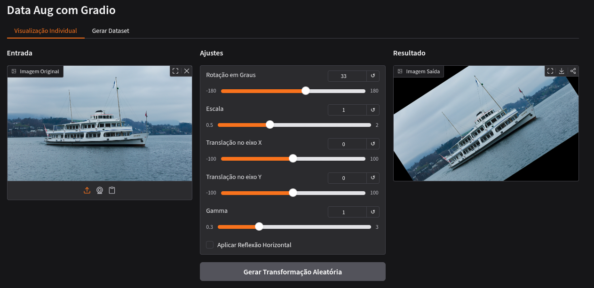

# Data Augmentation Interativo (Gradio)
 
Este projeto consiste em uma interface gráfica interativa desenvolvida com **Gradio** para a disciplina de **Visão Computacional**. O objetivo é permitir a visualização de transformações de data augmentation em tempo real e a geração de datasets personalizados via navegador.
 
## 📋 Funcionalidades
 
A interface está organizada em duas abas principais:
 
### 1 Aba: Visualização Individual
 
Permite o ajuste fino de uma única imagem através de controles manuais:
 
**Controles (Sliders):**
- **Rotação:** $-180°$ a $+180°$
- **Escala:** $0.5x$ a $2.0x$
- **Translação X e Y:** $-100$ a $+100$ pixels
- **Gamma:** $0.3$ a $3.0$
**Controles Adicionais:**
- **Reflexão Horizontal:** Através de checkbox
- **Modo Aleatório:** Botão para aplicar parâmetros randômicos instantaneamente
**Visualização:**
- Comparativo lado a lado entre a imagem Original e a Transformada

### 2 Aba: Geração de Dataset
 
Focada na criação de múltiplas variações para treinamento de modelos:
 
- **Quantidade:** Slider para definir entre 1 e 100 variações
- **Configuração de Ranges:** Definição de valores mínimos e máximos para Rotação, Escala e Gamma
- **Galeria:** Visualização em grade de todas as imagens geradas
- **Exportação:** Botão para baixar o dataset completo em um arquivo `.zip`
## 🚀 Instalação e Execução
 
### 1. Pré-requisitos
 
Além das bibliotecas de processamento (OpenCV, NumPy), este exercício requer o Gradio instalado:
 
```bash
# Instalação via pip:
pip install -r requirements.txt
 
# Instalação via uv:
uv pip install -r requirements.txt
```
 
### 2. Rodando a Interface
 
Execute o script principal para gerar o link local da interface:
 
```bash
# Execução padrão:
python exercicio-02-DANILO.py
 
# Execução via uv:
uv run exercicio-02-DANILO.py
```
 
## � Futuro e Deploy

Este projeto será aprimorado futuramente com melhorias na interface, mais transformações de data augmentation e uma organização mais clara do pacote.
Também está planejado o deploy em contêiner Docker para garantir execução consistente em qualquer ambiente.

## �📂 Organização do Código
 
Para garantir a legibilidade e manutenibilidade, o projeto foi modularizado:
 
- **`app.py`:** Contém toda a estrutura da interface, definição de abas, componentes e gerenciamento de eventos do Gradio

- **`src/data_aug.py`:** Módulo de backend que contém as funções matemáticas e lógicas de transformação (OpenCV), sendo uma refatoração do Exercício 1
## 📊 Demonstração
 
